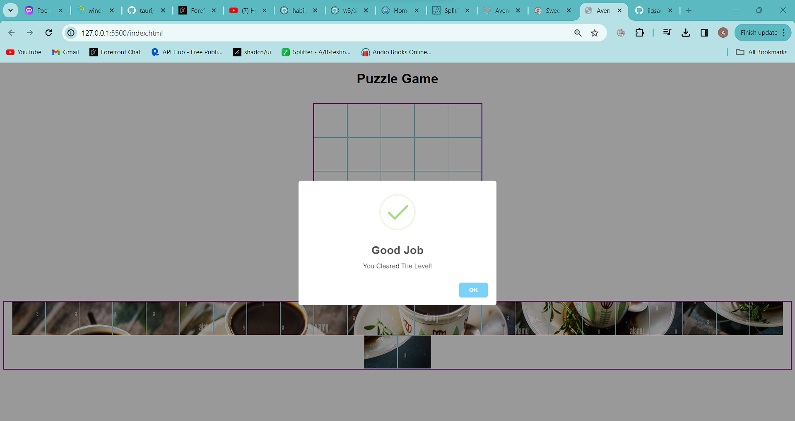

# GridSaw Puzzle Game

This is a simple web-based gridsaw puzzle game where players can solve gridsaw puzzles by dragging and dropping pieces to form the complete image.it is a variation of jigsaw puzzle but all pieces are cut in a square.have fun solving puzzles that represent the Ethiopian heritage and culture 

# [Puzzle-Game](https://github.com/switch247/jigsaw)
- Demo: https://commingsoon/

## Features

- Dynamic grid generation based on the number of puzzle pieces
- Drag and drop functionality for arranging puzzle pieces
- puzzle piece rotation
- Random shuffling of puzzle pieces at the start of the game
- Responsive design for different screen sizes
- canvas for border of puzzle piece 
## Technologies Used

- HTML5
- CSS
- JavaScript

## How to Use

1. Clone the repository to your local machine.
2. Open the `index.html` file in your web browser.
3. start the game, Start from level 0 and levels increase automatically when you win.
4. Use the drag and drop functionality to arrange the puzzle pieces and form the complete image.
5. double click to rotate the tile or image

## Folder Structure

- `index.html`: Main HTML file for the game
- `styles.css`: CSS file for styling the game interface
- `puzzle.js`: JavaScript file containing the game logic and functionality
- `images/`: Folder containing the puzzle images

## Contributing

Contributions are welcome! If you have any ideas for improvements or new features, feel free to submit a pull request.

## License

This project is licensed under the MIT License - see the [LICENSE](LICENSE) file for details.

Enjoy playing the jigsaw puzzle game!